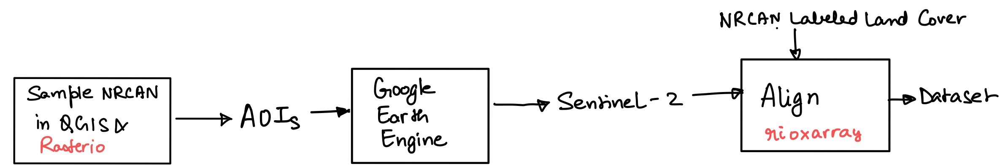
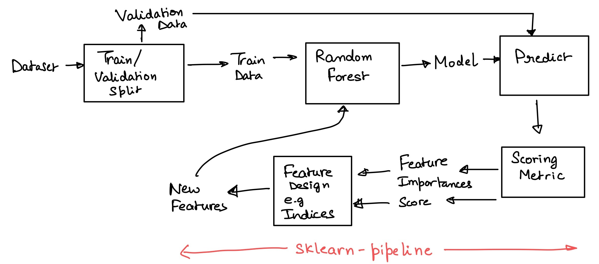

# Objective
Develop a multi-class land classifier with 80% accuracy (balanced accuracy score).

- Research papers on land cover classification using sentinel-2 and Random forests reach 80-90% accuracy

# Data Wrangling

## Land Cover Labels

[NRCAN 2015 dataset](https://open.canada.ca/data/en/dataset/4e615eae-b90c-420b-adee-2ca35896caf6)
Features:
- 30m spatial resolution
- 18 land cover types

To reduce the amount of training data:
- Few(10-12) locations according to land cover diversity are sampled in QGIS to create areas of interest(AOIs) (`data/geoms/lc_geo_coords.json` and `data/geoms/lc_sample_polygons.json`) using QGIS
- These geometries are further resampled using `rasterio` and `geopandas` to  512x512 pixel each. 
Because original AOIs were too big which resulted in huge sentinel-2 GeoTIFF size.
- sampling code is in `aoi_geoms.ipynb` 

## Sentinel-2 
- All 12 Raw Bands (B0-B9, B11, B12, B8A)
- AOIs from previous step are used to filter the sentinel-2 collection
- All images in July-Aug 2019-2021 w/ cloud cover less than 10% are considered
- Monthly mean composites are  obtained using **Google Earth Engine Python API**
- Vegetation and other auxilliary indices coming soon
- code in `download_sentinel_from_gee.ipynb`

## Aliging Datasets

- NRCAN and sentinel-2 have different CRS and spatial resolution
- `rioxarray.reproject_match` is used to align NRCAN to sentinel-2 CRS transform 




<br>
<br>

# Modeling

## Baseline Model
- ```RandomForestClassifier(n_estimators=100, max_features='sqrt', min_samples_leaf=10)```
- Train set 400K samples, validation set w/ 100K samples
- 40% balanced accuracy on validation set
- 23% accuracy on Test set
- Some classes in test set are missing in current train set

